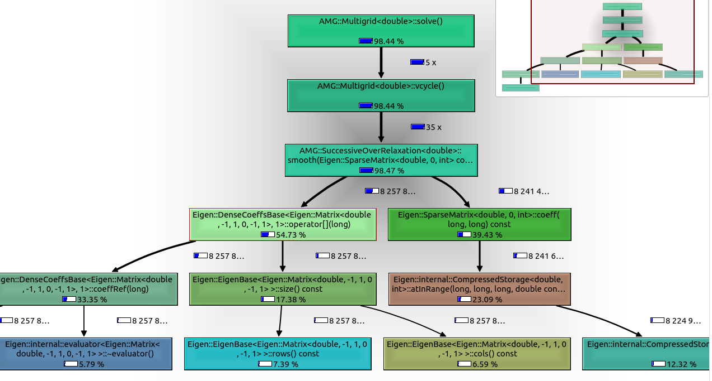

# algebraic-multigrid

Algebraic multigrid implementation using C++ and Eigen.

## Setting up Eigen3

Go to the [Eigen Wiki](https://eigen.tuxfamily.org/index.php?title=Main_Page) and download the latest stable release of Eigen 3.4.0. Alternatively click [here](https://gitlab.com/libeigen/eigen/-/archive/3.4.0/eigen-3.4.0.tar.gz) to do so. Then extract it into the `/usr/local/include` directory. Perhaps use  `FetchContent` in the future (see [here](https://stackoverflow.com/questions/65860094/how-to-add-eigen-library-to-a-cmake-c-project-via-fetchcontent)).

## Configuration in `cpp/`

To configure:

```bash
cmake -S . -B build
```

Add `-GNinja` if you have Ninja.

To build:

```bash
cmake --build build
```

To test (`--target` can be written as `-t` in CMake 3.15+):

```bash
cmake --build build --target test
```

To build docs (requires Doxygen, output in `build/docs/html`):

```bash
cmake --build build --target docs
```

# Classes

Planning for classes needed for algebraic multigrid.

```cpp
BaseSolver {
private:
  niters
  tolerance
  (?) Preconditioner
public:
  abstract solve(const Matrix& A, Vector& x, const Vector& b) const // inplace vector sys solve
  abstract solve(const Matrix& A, Matrix& X, const Matrix& B) const // inplace matrix sys solve
}

BaseGrid {
private:
  Matrix pdeSolution
  Matrix error
  Matrix residual
  dx
  dy
  nx
  ny
public:
  const& getters const
}

Multigrid {
private:
  BaseGrid[] grids # 0th == level 1 finest --> n-1^th == coarsest 
  nlevels
  Int[] iters
  restrict()
  prolongate()
public:
  solve()
}
```

# Debugging in `cpp/`

```shell
cmake -S . -B build-debug -DCMAKE_BUILD_TYPE=Debug # only do once
cmake --build build-debug
```

# Testing in `cpp/`

From [dolfinx](https://github.com/FEniCS/dolfinx/blob/6189a7e2f42a63cc2bafd10696862efb41f0c3f9/.circleci/config.yml#L32)

```shell
# TODO: Could go in a github action
# cmake -S test/ -B build/test/ -DCMAKE_BUILD_TYPE=Developer 
# cmake --build build/test
cd build/test
# for dolfinx in the target name is `unittests`
# ctest --output-on-failure -R testlib
ctest -T memcheck -R testlib
```

# Profiling

For profiling the code, I use KCacheGrind and Callgrind, which can be installed as below,

```shell
sudo apt-get install valgrind kcachegrind graphviz
```

run the program with the `valgrind` program, noting that the program will take longer than normal due to the profiling overhead,

```shell
valgrind --tool=callgrind program [program_options]
```

where `program` is binary from `cmake --build build`. So as an example,

```shell
valgrind --tool=callgrind ./build/test/testlib
```

followed by

```shell
kcachegrind callgrind<tab autcomplete>
```

will allow you to visualize the callgraph and identify performance bottlenecks.

# Notes

## Sparse Gauss Seidel

To keep things generic, one can use either the matrix formulation `Au = b` or one can write solvers that use the physical grid points themselves. Using the physicalgrid points in the solvers leads to solvers that are defined only for that particular
PDE, but it also makes the solver wayyyy faster. If the physical domain is `3 x 3`,that means there 9 degrees of freedom (dofs), and therefore the system `Au = b` requiresiterating through `A \in 9x9`, i.e., `O(ndofs^2)` compared to the specific solver whichis `O(n)`... (find resource for actually naming convention for these types of solvesr)...and also consider how you could approach differently or how other places do it differently. The difference in convention is known as describing the algorithm in terms of the square array `U[i,j]` or in terms of the column vector `Uhat`.

Since all the time is clearly being spent in the smoother, this needs to be improved. See Julia's [AlgebraicMultigrid/src/smoother.jl](https://github.com/JuliaLinearAlgebra/AlgebraicMultigrid.jl/blob/master/src/smoother.jl) for better smoother approaches for sparse systems.



In the sparse gauss seidel solver, the use of the ternary operator in the sparse matrix vector product arises from the definition of the Gauss Seidel iteration. The Gauss seidel iterations are defined as

$$
u_{i}^{(k+1)} = \frac{b_i - \sum_{j < i} a_{ij} u_j^{(k+1)} - \sum_{j > i} a_{ij} u_j^{(k)} }{a_{ii}},\ i = 1...n,
$$

and this implies that $j \neq i$ in the summations. Therefore the ternary operator for which the row and column match requires that the contribution to the summation be 0. The above might be more easily understood (and removing the $k^{th}$ iteration subscript for ease) as

$$
u_{i}^{(k+1)} = \frac{b_i - \sum_{j \neq i} a_{ij} u_j }{a_{ii}}.
$$

However, since we know that $A$ is sparse, for any given column $j$, we only need a small subset of the rows $i$ from $A$. It's worth noting that since our matrix is CSC format, it is faster to iterate through the column vectors (i.e, the rows) of $A$, and this iteration on the surface contradicts the formula given above, since the formula above is iterating through row vectors (i.e., the columns). However, since we assume $A$ is symmetric positive definite, then we know that $A^{T} = A$ and therefore iterating throughing the $j^{th}$ column vector is the same as iterating through the $j^{th}$ row vector. 

## Interpolation

For the restriction and prolongation operation, this seems to be dependent on the selected multigrid method. The [classical.jl from AlgebraicMultigrid.jl](https://github.com/JuliaLinearAlgebra/AlgebraicMultigrid.jl/blob/master/src/classical.jl) shows that this operation is performed using Ruge-Stuben method.

Though a simpler approach, i.e., linear interpolation is what is proposed in refs [9]
and [19].

# References

[1] : Intro Modern CMake. url: https://cliutils.gitlab.io/modern-cmake/chapters/basics/structure.html

[2] : Pawar S, San O. 6.3: Multigrid Framework in "CFD Julia: A Learning Module
Structuring an Introductory Course on Computational Fluid Dynamics". Fluids.
2019; 4(3):159. https://doi.org/10.3390/fluids4030159

[3] : DOLFINX: Python Binding Example for C++. url: https://github.com/FEniCS/dolfinx

[4] : Nanobind docs. url: https://nanobind.readthedocs.io/en/latest/installing.html

[5] : Modern CMake: Simple Example and Links to Extended Examples. url: https://cliutils.gitlab.io/modern-cmake/chapters/basics/example.html

[6] : amgcl: Good Inspiration for AMG design. url: https://amgcl.readthedocs.io/en/latest/amg_overview.html

[7] : AMG = iterative solver if V-cycle until n-iterations or convergence, but more often a single V-cycle used for preconditioner to get (?) $M^{-1} v$ (see BDDC for example, or Preconditioners/diagonal.jl). url: https://github.com/ddemidov/amgcl/issues/230

[8] : Long, Chen. Programming of Multigrid Methods. url: https://www.math.uci.edu/~chenlong/226/MGcode.pdf

[9] : Kostler, Harald. Multigrid HowTo: A simple Multigrid solver in C++ in less
than 200 lines of code. url: https://www10.cs.fau.de/publications/reports/TechRep_2008-03.pdf

[10] : On class template and header files. url: https://stackoverflow.com/questions/495021/why-can-templates-only-be-implemented-in-the-header-file

[11] : Cmake: Header only library. url: https://stackoverflow.com/questions/60604249/how-to-make-a-header-only-library-with-cmake

[12] : Build cmake debugging. url: https://hsf-training.github.io/hsf-training-cmake-webpage/08-debugging/

[13] : For good CI/CD example, see Dolfinx workflow. url: https://github.com/FEniCS/dolfinx/blob/main/.github/workflows/ccpp.yml

[14] : General DevSecOps. url: https://medium.com/@rahulsharan512/devsecops-using-github-actions-building-secure-ci-cd-pipelines-5b6d59acab32

[15] : Iterative solvers and square vs. column formulation. url: https://people.eecs.berkeley.edu/~demmel/cs267/lecture24/lecture24.html

[16] Multigrid in MATLAB with a recursive algorithm. url: https://nl.mathworks.com/help/parallel-computing/solve-differential-equation-using-multigrid-preconditioner-on-distributed-discretization.html

[17] : Ruge, J. W., & Stüben, K. (1987). Algebraic multigrid (AMG). In S. F. McCormick (Ed.), Multigrid methods (Vol. 3, pp. 73–130). SIAM. https://doi.org/10.1137/1.9781611971057

[18] : Classical Ruge-Stuben Multigrid Python Code. url: https://pyamg.readthedocs.io/en/latest/\_modules/pyamg/classical/classical.html

[19] : Briggs et. al. Chapter 4: Implementation in "A Multigrid Tutorial, 2ed" (2000).
